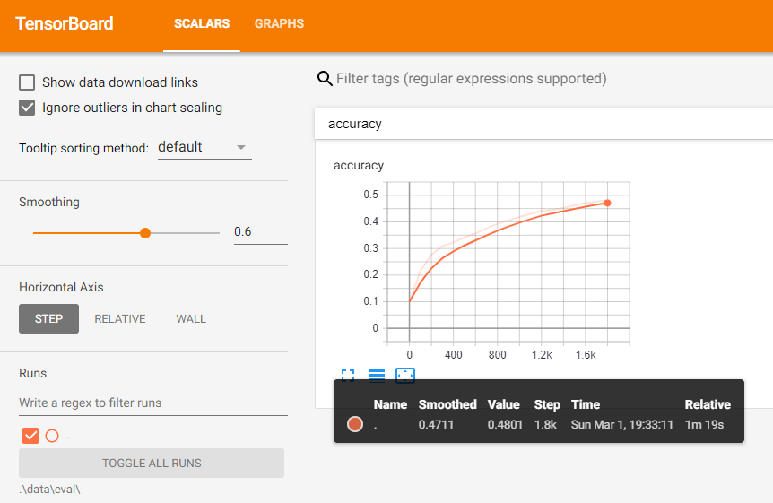
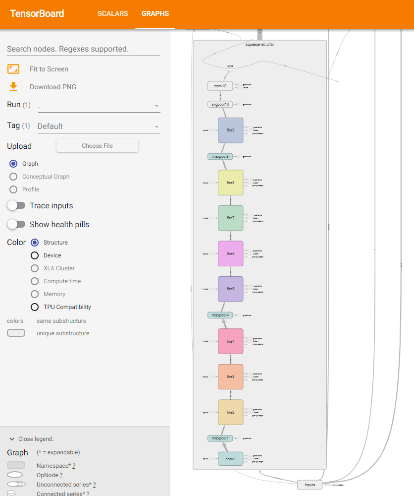

<h1>SqueezeNet Model
---

- [Setup Data](#setup-data)
- [Training](#training)
- [Testing](#testing)
- [Tracing](#tracing)
- [Visualizing](#visualizing)
- [Details](#details)
- [Architecture](#architecture)
- [Links](#links)

# Setup Data

We have a [a fork](https://github.com/PatriceVignola/squeezenet) of [Vonclites' implementation](https://github.com/vonclites/squeezenet) of SqueezeNet for TensorFlow that can be used for training and inference, and it uses the CIFAR-10 dataset by default. These steps only need to be performed once (preferably in a [conda](https://docs.conda.io/en/latest/miniconda.html) environment).

Change the working directory to the root-level `squeezenet` folder and ensure you have the pip packages. Then run the setup script to download and convert data:

```
pip install -r requirements.txt
python setup.py
```

Running `setup.py` should take at least a minute or so, since it downloads the CIFAR-10 dataset and converts it into TFRecord format. The output of running it should look similar to the following:

```
>> Downloading cifar-10-python.tar.gz 100.0%
Successfully downloaded cifar-10-python.tar.gz 170498071 bytes.
2020-05-05 11:59:51.471453: I tensorflow/core/platform/cpu_feature_guard.cc:142] Your CPU supports instructions that this TensorFlow binary was not compiled to use: AVX2
2020-05-05 11:59:51.627735: I tensorflow/stream_executor/platform/default/dso_loader.cc:52] Successfully opened dynamic library C:\Users\justoeck\bin\directml\cd94a3e_redist_release/DirectML.dll
>> Reading file [data\cifar-10-batches-py\test_batch] image 10000/10000WARNING:tensorflow:From C:\Users\justoeck\desktop\tfmodels\squeezenet\src\models\research\slim\datasets\dataset_utils.py:176: The name tf.gfile.Open is deprecated. Please use tf.io.gfile.GFile instead.


Finished converting the Cifar10 dataset!
cifar-10-python.tar.gz does not exists.
Downloading cifar-10-python.tar.gz
167kKB [00:07, 23.0kKB/s]
Saving train images: 100%|█████████████████████████████████████████████████████| 50000/50000 [00:29<00:00, 1685.43it/s]
Saving test images: 100%|██████████████████████████████████████████████████████| 10000/10000 [00:05<00:00, 1684.41it/s]
```

# Training

A helper script exists to train SqueezeNet with default data, batch size, and so on:

```
python train.py
```

The first few lines of output should look similar to the following (exact numbers may change):
```
Train Step 0    :  0.0625
Evaluation Step 0    :  0.1
Train Step 1    :  0.2188
Train Step 2    :  0.03125
Train Step 3    :  0.0625
Train Step 4    :  0.09375
Train Step 5    :  0.125
Train Step 6    :  0.1562
Train Step 7    :  0.125
Train Step 8    :  0.1562
Train Step 9    :  0.125
Train Step 10   :  0.125
```

By default, the script will run for 1800 training steps with a batch size of 32 and print the accuracy for each step. The training script can be run multiple times and saves progress with checkpoints every 100 steps (by default). If you've already trained 1800 steps, running `train.py` will have no effect; you may run `python clean.py` to delete the checkpoints and start over.

The accuracy should increase over time. With the default arguments (intended for speed, which prefer speed over quality), you should see around 45-55% accuracy after 1800 steps. The exact value will vary, but if it's substantially lower then something is probably not right.

```
Evaluation Step 1800 :  0.467
```

You can inspect `train.py` (and the real script, `src/train_squeezenet.py`) to see the command line it is invoking or adjust some of the parameters. Increasing the batch size will, in general, improve the accuracy. 

Once you're finished with training (at least one checkpoint must exist), you can save the model for testing.

```
python src/save_squeezenet.py --model_dir data
```

# Testing

Once the model is trained and saved we can now run the prediction using the following steps. Feel free to change the input image from the test set. Make sure that the data_format layout matches the same layout that the model is trained with.

```
python src/predict_squeezenet.py --model_dir data --data_format NCHW --image data/cifar10_images/test/ship/0001.png
```

You should see the result such as this:

```
data/cifar10_images/test/ship/0001.png: predicted ship
```

# Tracing

It may be useful to get a trace of TensorFlow during training. As with training, there is a wrapper script for convenience:

```
python trace.py
```

With default settings, you'll see output like the following:

```
Train Step 0    :  0.0625
Train Step 1    :  0.1875
Train Step 2    :  0.0625
Train Step 3    :  0.1562
Train Step 4    :  0.1875
Train Step 5    :  0.2188
Train Step 6    :  0.3125
Train Step 7    :  0.1875
Train Step 8    :  0.2812
Train Step 9    :  0.1875
cifar_trace_0.json duration : 674.313 ms
cifar_trace_1.json duration : 100.84 ms
cifar_trace_2.json duration : 22.111 ms
cifar_trace_3.json duration : 24.679 ms
cifar_trace_4.json duration : 24.118 ms
cifar_trace_5.json duration : 24.587 ms
cifar_trace_6.json duration : 22.864 ms
cifar_trace_7.json duration : 22.397 ms
cifar_trace_8.json duration : 23.305 ms
cifar_trace_9.json duration : 24.022 ms
{"min": 22.111, "max": 674.313, "median": 24.118, "measurements": [22.111, 22.397, 22.864, 23.305, 24.022, 24.118, 24.587, 24.679, 100.84, 674.313]}
```

The first few traces are typically much slower on DML, since our kernels won't have been cached yet (compiling DML operators can be expensive). You can inspect the timelines for the traces by opening one of the saved json files in Chrome/Edge and navigating to `chrome://tracing` in the browser.

# Visualizing

You can launch TensorBoard from the same conda environment you're using to train/test the model. This can be done before or after you've trained; you simply point it at the `data/eval` directory where events are recorded and it will update automatically.

```
tensorboard --logdir data/eval
```

Once you've started tensorboard from the command line, it will present you with an address to access it from the browser (e.g. `http://localhost:6006/`). Enter the address in your browser and you will see two tabs at the top: *Scalars* and *Graph*. 

For SqueezeNet, the scalars tab will show training accuracy. This tab will be empty if you have not yet trained, but it will update if you run training in the background.



The graph tab always shows the computational graph. You'll find that the graph view is a bit messier than an ONNX graph visualized with Netron: it contains all sorts of helper functions for reading data, variables, computing gradients, control flow, and so on. You can expand many of the nodes to break them up further until you see individual op_nodes in the graph, which will tell you on which device they were placed.



# Details

Some of the interesting parameters of `train_squeezenet.py` you may want to adjust:

- `--batch_size <int>` : a larger value will be slower to compute but may converge faster and yield better accuracy. Try 32 or 256.
- `--data_format [NCHW|NHWC]` : layout of image data. NCHW is faster with DML; NHWC is faster with CUDA.
- `--max_train_steps <int>` : total number of training steps to execute. Default is 1801. You may want to reduce this when taking a trace for profiling.
- `--summary_interval <int>` : number of steps between printing network accuracy on a batch of training data. Informational purposes only (does not affect training quality).
- `--checkpoint_interval <int>` : number of steps between checkpoints. A checkpoint saves training progress, so re-running this script will pick up where the last checkpoint was taken. Convenience purposes only (does not affect training quality). Default is 100.
- `--validation_interval <int>` : number of training steps between evaluation steps. An evaluation steps runs the network on the test dataset (normal training steps use the training dataset). Informational purposes only (does not affect training quality). Default is 100.
- `--keep_last_n_checkpoints <int>` : max number of checkpoints to save. Default is 3.

If you let the script run to completion and let it save checkpoints, subsequent invocations will have no effect. You will need to either increase the max_train_steps or clean the data. The data directory created in the setup step may have checkpoints, events, and traces saved inside into it as you train. In a clean state, it only contains the following files:

```
cifar10_images\  cifar10_test.tfrecord  cifar10_train.tfrecord  labels.txt
```

# Architecture

[SqueezeNet](https://arxiv.org/abs/1602.07360) is a convolutional neural network (CNN) that can classify images, and its claim to fame is achieving high accuracy with a small model size. The original paper, published in 2017, provides intuition on how to reduce the number of parameters in a CNN-based model at an architectural level. This approach was different from other state-of-the-art model compression techniques at the time, which focused on post-processing a pretrained model using quantization, Huffman encoding, and sparse matrices that eliminate close-to-zero weights. The authors showed that the strategies used in SqueezeNet's design are complementary with existing model compression techniques, resulting in a tiny model (4.8MB before compression; 0.47MB after) that has similar accuracy to AlexNet (240MB before compression; 6.9MB after).

Many CNNs extensively use 3x3 or 5x5 convolution filters that sample along all channels of the input, and these filters requires a large number of parameters. Two of the strategies used to limit the size of SqueezeNet involve replacing larger 3x3 filters with 1x1 filters, and reducing the number of input channels in the 3x3 filters that remain. These two strategies culminate in the so-called *fire module*. The authors refer to structurally similar compositions of smaller layers as *modules*, and the fire module consists entirely of 1x1- and 3x3-sized convolution filters grouped into a *squeeze layer* and *expand layer*:


The *squeeze layer* of a fire module is exclusively 1x1 filters, and it reduces the number of channels passed on to the following expand layer (hence the name squeeze). The expand layer has an equal number of 1x1 and 3x3 filters, and its output increases the number of channels passed on to the following layers (hence the name expand).

A third strategy employed in SqueezeNet's design aims to maximize accuracy -- especially important with the reduced number of parameters -- by placing pooling layers toward the end of the model. The relu activations occur on the relatively larger output of the expand layer, *before downsampling* with pooling, which illustrates the third strategy to preserve accuracy.


The model described in the paper contains only 15 macro-level layers, most of which are so-called *fire modules*. Alternative designs shown in the paper use simple and complex bypass connections, which are similar to those used in residual networks (e.g. ResNet): for example, the output from each fire module is piped as input into the next two fire modules. However, these alternative designs are rarely used in the implementations found online (e.g. ONNX, TensorFlow, Caffe). Furthermore, the exact placement of the MaxPool layers varies in each implementation. For example, the paper shows a 3/4/1 fire module split between pooling layers, but the [ONNX implementation](https://github.com/onnx/models/tree/master/vision/classification/squeezenet/squeezenet) uses a 2/2/4 split. The [TensorFlow implementation](https://github.com/PatriceVignola/squeezenet) we are using matches the original paper's layout. 

# Links

- [Original paper](https://arxiv.org/abs/1602.07360)
- [Original source (Caffe)](https://github.com/forresti/SqueezeNet)
- [Original training data (LSVRC 2012)](http://www.image-net.org/challenges/LSVRC/2012/)
- [Alternative training data (CIFAR-10)](https://www.cs.toronto.edu/~kriz/cifar.html)
- [Implementation: TensorFlow (Vonclites)](https://github.com/vonclites/squeezenet)
- [Implementation: TensorFlow (Pat's Fork of Vonclites)](https://github.com/PatriceVignola/squeezenet)
- [Implementation: TensorFlow (MKOS on CIFAR-10)](https://github.com/mkos/squeezenet)
- [Implementation: TensorFlow (Tandon-A on Tiny ImageNet)](https://github.com/Tandon-A/SqueezeNet)
- [Implementation: ONNX](https://github.com/onnx/models/tree/master/vision/classification/squeezenet/squeezenet)